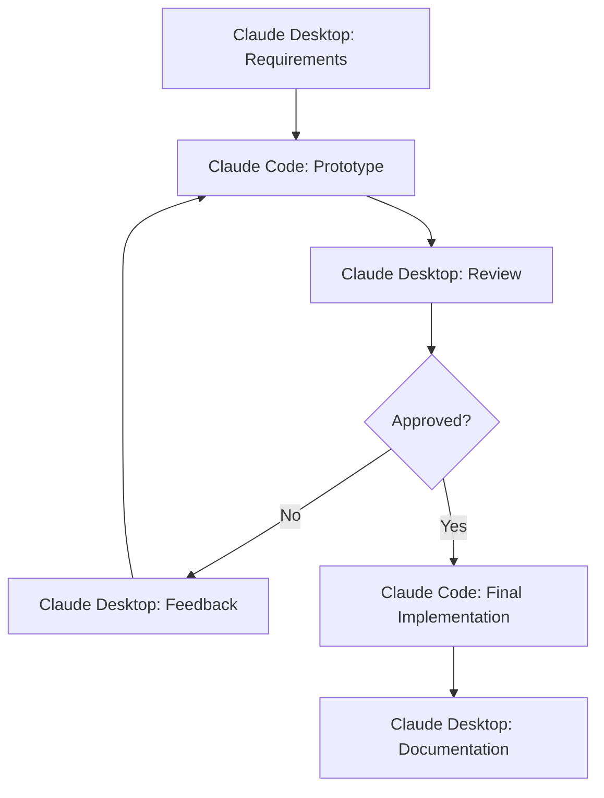

# Claude Desktop & Code Integration Patterns

This document describes effective patterns for integrating Claude Desktop and Claude Code to maximize productivity while avoiding MCP overload.

## Core Integration Principles

### 1. Separation of Concerns

**Claude Desktop**: Knowledge work, planning, documentation
**Claude Code**: Execution, implementation, automation

### 2. Handoff Patterns

#### Pattern 1: Plan → Execute → Document

```python
# 1. Planning Phase (Claude Desktop)
plan = claude_desktop("""
    Create a detailed plan for implementing user authentication:
    - Architecture decisions
    - Security considerations  
    - API design
    - Frontend flow
""")

# 2. Execution Phase (Claude Code)
implementation = subprocess.run([
    "claude", "-p", f"Implement based on plan: {plan}",
    "--allowedTools", "Task,Edit,Write,Bash"
])

# 3. Documentation Phase (Claude Desktop)
docs = claude_desktop(f"""
    Document the implementation:
    - API endpoints
    - Usage examples
    - Security notes
    Implementation details: {implementation.stdout}
""")
```

#### Pattern 2: Parallel Analysis

```javascript
// Use Claude Code's Task tool for parallel analysis
const analysisResult = await claudeCode(`
    Use Task to spawn 4 specialized agents:
    1. Security Auditor - review authentication flow
    2. Performance Analyst - check for bottlenecks
    3. UX Reviewer - assess user experience
    4. Code Quality Inspector - check best practices
    
    Synthesize all findings into a report.
`, ['Task', 'Write']);

// Use Claude Desktop to create action plan
const actionPlan = await claudeDesktop(`
    Based on this analysis: ${analysisResult}
    Create a prioritized action plan for improvements.
`);
```

## Advanced Integration Patterns

### 1. Feedback Loop Pattern



Implementation:

```python
def feedback_loop_workflow(requirements):
    """
    Iterative development with feedback loops
    """
    approved = False
    iteration = 0
    
    while not approved and iteration < 5:
        # Create prototype
        prototype = claude_code(
            f"Create prototype based on: {requirements}",
            tools=["Write", "Edit"],
            think_level="think"
        )
        
        # Review with Desktop
        review = claude_desktop(f"""
            Review this prototype:
            {prototype}
            
            Check for:
            - Requirements compliance
            - Best practices
            - User experience
            
            Provide structured feedback or approve.
        """)
        
        if "approved" in review.lower():
            approved = True
        else:
            requirements = f"{requirements}\n\nFeedback: {review}"
            iteration += 1
    
    # Final implementation
    if approved:
        final = claude_code(
            f"Create final implementation based on approved prototype",
            tools=["Write", "Edit", "Test"],
            think_level="ultrathink"
        )
    
    return final
```

### 2. Context Preservation Pattern

```python
class ContextManager:
    """
    Preserve context between Claude Desktop and Code
    """
    
    def __init__(self):
        self.context = {
            "project_state": {},
            "decisions": [],
            "implementations": [],
            "feedback": []
        }
    
    def plan_with_desktop(self, prompt):
        # Add context to prompt
        contextualized_prompt = f"""
        Project Context:
        {json.dumps(self.context, indent=2)}
        
        Task: {prompt}
        """
        
        result = claude_desktop(contextualized_prompt)
        self.context["decisions"].append({
            "timestamp": datetime.now().isoformat(),
            "decision": result
        })
        
        return result
    
    def execute_with_code(self, prompt, tools=[]):
        # Include relevant context
        recent_decisions = self.context["decisions"][-3:]
        
        contextualized_prompt = f"""
        Recent decisions:
        {json.dumps(recent_decisions, indent=2)}
        
        Implementation task: {prompt}
        """
        
        result = claude_code(
            contextualized_prompt,
            tools=tools
        )
        
        self.context["implementations"].append({
            "timestamp": datetime.now().isoformat(),
            "implementation": result
        })
        
        return result
    
    def save_context(self, filename="project-context.json"):
        with open(filename, 'w') as f:
            json.dump(self.context, f, indent=2)
```

### 3. Specialized Agent Pattern

```python
class SpecializedAgents:
    """
    Different agents for different tasks
    """
    
    @staticmethod
    def architect(task):
        """High-level architecture decisions"""
        return claude_desktop(f"""
            As a software architect, design:
            {task}
            
            Consider:
            - Scalability
            - Maintainability
            - Security
            - Performance
        """)
    
    @staticmethod
    def developer(task, architecture):
        """Implementation based on architecture"""
        return claude_code(
            f"Implement based on architecture: {architecture}\n\nTask: {task}",
            tools=["Write", "Edit", "Test"],
            think_level="think hard"
        )
    
    @staticmethod
    def reviewer(code):
        """Code review and suggestions"""
        return claude_code(
            f"Review this code: {code}\n\nCheck for: bugs, performance, security, best practices",
            tools=["Read"],
            think_level="ultrathink"
        )
    
    @staticmethod
    def documenter(implementation):
        """Create documentation"""
        return claude_desktop(f"""
            Create comprehensive documentation for:
            {implementation}
            
            Include:
            - Overview
            - API reference
            - Examples
            - Troubleshooting
        """)
```

## Integration Anti-Patterns to Avoid

### 1. ❌ Tool Duplication
```python
# BAD: Using MCP web servers when Claude Code has WebFetch
config = {
    "mcpServers": {
        "web-fetch": {...}  # Claude Code already has this!
    }
}

# GOOD: Use built-in tools
claide_code("Fetch data from API", tools=["WebFetch"])
```

### 2. ❌ Context Loss
```python
# BAD: Starting fresh each time
result1 = claude_desktop("Plan feature X")
result2 = claude_code("Implement something")  # Lost context!

# GOOD: Preserve context
plan = claude_desktop("Plan feature X")
impl = claude_code(f"Implement this plan: {plan}")
```

### 3. ❌ Wrong Tool for the Job
```python
# BAD: Using Desktop for coding
code = claude_desktop("Write a Python function to...")

# GOOD: Use Code for implementation
code = claude_code("Write a Python function to...", tools=["Write"])
```

## Best Practices

### 1. Start Minimal
- Begin with no MCP servers
- Add only when hitting limitations
- Monitor performance impact

### 2. Clear Handoffs
- Explicit context passing
- Structured data formats
- Clear success criteria

### 3. Leverage Strengths
- Desktop: Planning, analysis, documentation
- Code: Implementation, testing, automation

### 4. Measure and Iterate
- Track time saved
- Monitor error rates
- Gather user feedback
- Continuously optimize

---

*Last updated: June 2025*